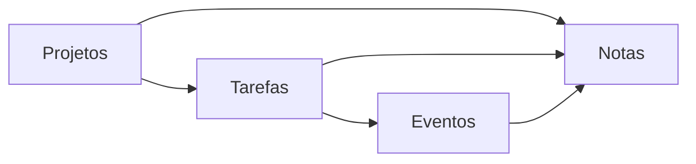

<div align="center">

# Planner-Py

App Desktop, offline-first, de organização e planejamento pessoal com foco em interconectividade e produtividade.

[Funcionalidades](#funcionalidades) | [Instalação](#instalação) | [Roadmap](#roadmap)

Ferramentas:


Detalhes:


Suporte:


</div>

## Nosso Objetivo

Criar um planejador pessoal **local, multi-plataforma e altamente interconectado**, com três pilares centrais:

- **Interconectividade:** Objetos do app podem ser relacionados
- **Produtividade:** Ferramenta que te ajuda a organizar projetos, definir prioridades e estabelecer sessões de foco
- **Customização e Liberdade:** banco local, sem dependência de cloud ou internet

## Nosso Workflow



## Funcionalidades

### Interconectividade

<details>
<summary><strong>Projetos</strong></summary>

- Usando da metodologia Kanban, podemos criar projetos
- Projetos contam com colunas que descrevem as etapas atuais
- Cards representam milestones desse projeto, e podem ter suas próprias subtarefas!
- É possível atrelar um prazo aos seus projetos, tornando-os mais urgentes
- Ao anexar uma nota, você pode registrar e documentar referências
	
> **W.I.P**

</details>

<details>
<summary><strong>Tarefas</strong></summary>

- Tarefas podem ser criadas, ordenadas ou concluidas
- Tarefas que podem ser integradas a um projeto, quebrando grandes etapas em estruturas claras
- Ao receber um prazo, tarefas criam um evento, este, pode ser recorrênte ou durar multiplos dias
- Conectar tarefas a uma nota permite visualizar e documentar referencias fácilmente
- Permite a busca por Lista de Tarefas, ou tasks individuais

</details>

<details>
<summary><strong>Eventos</strong></summary>

- Função de Calendário e Agenda
- Permite criar compromissos, estender sua duração e até gerar recorrência
- Eventos podem ser criados como prazos de tarefas e projetos.
- Permite Busca global por mês e título 

</details>

<details>
<summary><strong>Notas</strong></summary>

- Editor Markdown que permite criar pastas e notas
- Funções de Destaque incluem Auto-save, Ordenação, Download e Upload de arquivos
- Suporte a Mermaid e LateX
- Permite Busca global por pasta, título ou trecho do documento

</details>

<details>
<summary><strong>Graph</strong></summary>

- Mapa visual de como os objetos do app se relacionam
- Permite ver todos os objetos relacionados, projetos, tasks, eventos e notas em um mapa navegável

	> **W.I.P**

</details>

### Produtividade

<details>
<summary><strong>Pesquisa</strong></summary>

- Barra de pesquisa global acessível de qualquer tela
- Permite buscar Notas, 
- Formato pensado pra crescer: cada módulo novo entra como uma seção a mais no mesmo resultado

> **W.I.P**
	
</details>

<details>
<summary><strong>Priorização</strong></summary>

- Matrix de Eisenhower, permite classifica tasks e cards em 4 quadrantes (Fazer / Agendar / Delegar / Deletar)
- Ao classificar, os itens são filtrados e destacados na lista ou kanban de origem
- Filtros por prazo, ordem alfabética e projeto

> **W.I.P**

</details>

<details>
<summary><strong>Foco</strong></summary>

- Timer Pomodoro com ciclos configuráveis: trabalho, descanso curto e descanso longo
- Alarme sonoro e popup que puxa a janela ao fim de cada fase
- Contador de ciclos completados e indicador de fase atual
- Widget que possibilita acompanhar em qualquer aba da ferramenta

> **W.I.P**

</details>

### Customização

<details>
<summary><strong>Visuais</strong></summary>

- Tema claro e escuro, 
-	Cor de Destaque
- Fonte do app padrão, serifada ou monoespaçada
- Ícone e cor individual por objeto (mais de 2.000 ícones)

</details>

<details>
<summary><strong>Comportamentos</strong></summary>

- Configurações de janela (resolução e orientação)
- Preferências dedicadas por módulo que permitem customizar o comportamentos individuais

</details>

<details>
<summary><strong>Portabilidade</strong></summary>

- Reset para preferências base
- 	Export e import de cofre *db entre máquinas

> **W.I.P**

</details>

<details>
<summary><strong>Perfis (Vaults)</strong></summary>

- Ferramenta que permite criar múltiplos cofred *.db e armazenar informações de acordo com o seu perfil
- Cofres podem ser protegidos por senha, requisitando ao entrar, gravar ou deletar 

> **W.I.P**

</details>

## Roadmap

- [ ] Interconectividade
    - [x] Notas
    - [x] Tasks
    - [x] Events
    - [x] Projects
    - [ ] Graph

- [ ] Customização e Luberdade
    - [ ] Import/Export
    - [ ] Customização
    - [ ] Vaults

- [ ] Produtividade
    - [ ] Eisenhower Matrix
    - [ ] Pomodoro
    - [ ] Dashboard


## Suporte

- [x] Linux
- [x] Windows
- [ ] Mac
- [ ] Android


## Stack

<div align="center">

| Camada | Ferramentas |
|-|-|
| Back-End | Python · Flask 3.1.3 · SQLAlchemy 2.0.51 |
| Banco de Dados | SQLite local (`planner.db`) |
| Desktop | PyWebView 6.2.1 · janela configurável (resolução/orientação/redimensionável via Settings) |
| Front-End | Bootstrap 5.3.8 · Bootstrap Icons 1.13.1 · Jinja2 |
| Extras | FullCalendar 6 · EasyMDE · Mermaid.js · marked.js · highlight.js (todos offline) |

</div>

## Instalação

```bash
# Clone o repositório
git clone https://github.com/NycolasGarcia/Planner-Py.git

# Entre na pasta
cd Planner-Py

# Crie o ambiente virtual
python -m venv venv

# Ative o ambiente
venv\Scripts\activate

# Instale as dependências
pip install -r requirements.txt

# Execute
py app.py
```

> Recentemente, uma alternativa que indepente de terminal foi criada para simplificar operação
> Basta acessar a pasta Planner-py/dist, selecionar o arquivo `boot.py` e *'Executar como programa'*
> Funcional para ambos Windows e Linux

## Estrutura do Projeto

```
Planner-Py/
│
├── app.py                       # Entrada: Flask + PyWebView
├── requirements.txt
│
├── dist/
│   └── boot.py                  # Launcher (cria venv, instala deps, abre sem terminal)
│
├── db/
│   ├── base.py                  # DeclarativeBase
│   ├── database.py              # Engine + SessionLocal (Android-aware)
│   └── init_db.py               # Criação das tabelas + migrações
│
├── models/                      # ORM models (um arquivo por entidade)
│   ├── note.py · note_folder.py
│   ├── event.py
│   ├── project.py · project_column.py · project_card.py
│   ├── task_list.py · task.py
│   └── settings.py
│
├── routes/                      # Flask blueprints (um arquivo por módulo)
│
├── templates/
│   ├── common/                  # base.html, header, aside
│   │   └── modals/              # search_bar, icon_picker, color_picker, folder_picker, changelog
│   └── *.html                   # Uma página por módulo
│
└── static/
    ├── bootstrap/                # Bootstrap 5.3.8 (offline)
    ├── bootstrap-icons-1.13.1/   # Bootstrap Icons (offline)
    ├── easymde/                  # Editor Markdown de Notas (offline)
    ├── fullcalendar/              # Calendário de Eventos (offline)
    ├── highlight/                 # Syntax highlighting (offline)
    ├── mermaid/                   # Diagramas em blocos de código (offline)
    ├── aos/
    └── js/

```

## Contato

<div align="center">

| Plataforma | Link |
|------------|------|
|  LinkedIn | <a href="https://www.linkedin.com/in/NycolasAGRGarcia/" target="_blank">Acessar</a> |
|  GitHub | <a href="https://github.com/NycolasGarcia" target="_blank">Acessar</a> |
|  Gmail | <a href="mailto:nycolasagrg.work@gmail.com">Enviar</a> |
|  Vercel | <a href="https://dev-nycolas-garcia.vercel.app/" target="_blank">Visitar</a> |

</div>