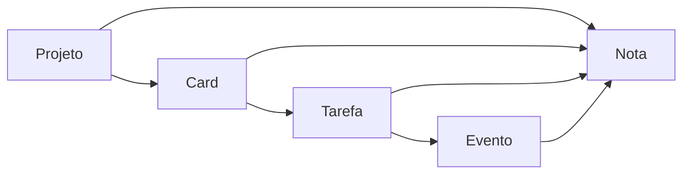

<div align="center">

# Planner-Py

App Desktop, offline-first, de organização e planejamento pessoal com foco em interconectividade e produtividade.

[Funcionalidades](#funcionalidades) | [Instalação](#instalação) | [Roadmap](#roadmap)

Ferramentas:


Detalhes:


Suporte:


</div>

## Nosso Objetivo

Criar um planejador pessoal **local, offline e altamente interconectado**, com três pilares centrais:

- **Interconectividade:** objetos do app (projetos, tasks, eventos, notas) se linkam bidirecionalmente entre si
- **Produtividade:** Eisenhower Matrix para priorização e Pomodoro para sessões de foco
- **Customização e Liberdade:** banco local, sem dependência de cloud, configurações extensivas e importação/exportação do DB

## Nosso Workflow



## Funcionalidades

### Interconectividade

<details>
<summary><strong>Projetos</strong></summary>

- Kanban com colunas e cards organizados por projeto
- Cards com prazo, ícone, cor e classificação Eisenhower
- Cada card pode ter uma Task List vinculada
- Drag & drop de cards entre colunas com persistência de ordem

> **W.I.P: Em desenvolvimento**

</details>

<details>
<summary><strong>Tasks</strong></summary>

- Task Lists stand-alone ou acopladas a cards de projeto
- Tasks com prazo (`due_date`), ícone, cor e prioridade
- Drag & drop para reordenação; toggle de conclusão
- Validação de prazo pai/filho: task não pode vencer depois do pai

> **W.I.P: Em desenvolvimento**

</details>

<details>
<summary><strong>Eventos</strong></summary>

- Calendário mensal (grid 7×5) e agenda cronológica
- Recorrência em 4 tipos: intervalo fixo, dias da semana, dia do mês ou anual
- Task com `due_date` gera e vincula um Evento automaticamente
- Task reset automático em tasks recorrentes ao virar o dia

> **W.I.P: Em desenvolvimento**

</details>

<details>
<summary><strong>Notas</strong></summary>

- Notas podem ser anexadas a qualquer objeto do app (projeto, card, task, evento)
- Todos os vínculos são bidirecionais — criáveis de qualquer ponta
- Editor Markdown com render em tempo real e suporte a blocos `mermaid`
- Pin, cor e ícone por nota; busca e ordenação

> **W.I.P: Em desenvolvimento**

</details>

### Produtividade

<details>
<summary><strong>Pesquisa</strong></summary>

- Barra de pesquisa global acessível de qualquer tela
- Encontra projetos, tasks, notas, eventos e settings em uma única busca

> **W.I.P: Em desenvolvimento**

</details>

<details>
<summary><strong>Priorização</strong></summary>

- Eisenhower Matrix: classifica tasks e cards nos 4 quadrantes (Fazer / Agendar / Delegar / Deletar)
- Ao classificar, o item muda de cor na lista ou kanban de origem
- Filtros por prazo, ordem alfabética e projeto

> **W.I.P: Em desenvolvimento**

</details>

<details>
<summary><strong>Foco</strong></summary>

- Timer Pomodoro com ciclos configuráveis: trabalho, descanso curto e descanso longo
- Alarme sonoro (Web Audio API) e popup que puxa a janela ao fim de cada fase
- Contador de ciclos completados e indicador de fase atual

> **W.I.P: Em desenvolvimento**

</details>

### Customização

<details>
<summary><strong>Visuais</strong></summary>

- Tema claro/escuro com toggle
- Cor de destaque (accent color) via CSS variables
- Ícone e cor individual por objeto (Bootstrap Icons — mais de 2.000 ícones)

> **W.I.P: Em desenvolvimento**

</details>

<details>
<summary><strong>Comportamentos</strong></summary>

- Configurações por módulo: Events, Projects, Tasks, Notes, Focus, Ranks
- Preferências de editor de notas (split pane ou toggle edit/render)
- Configurações de ciclo Pomodoro

> **W.I.P: Em desenvolvimento**

</details>

<details>
<summary><strong>Portabilidade</strong></summary>

- Export e import do banco de dados (`planner.db`) entre máquinas
- Export e import de settings para JSON
- Diálogo de arquivo nativo via PyWebView — sem dependência de cloud

> **W.I.P: Em desenvolvimento**

</details>

## Roadmap

- [x] Foundation: docs, schema, modelos ORM e estrutura base
- [ ] Notes — CRUD completo + editor Markdown + Mermaid
- [ ] Tasks + Task Lists — CRUD + drag & drop + due dates
- [ ] Events — calendário + recorrência em 4 tipos
- [ ] Projects / Kanban — colunas, cards, drag & drop
- [ ] Interconectividade — vínculos bidirecionais entre todos os objetos
- [ ] Eisenhower Matrix — classificação + reflexo visual nas listas
- [ ] Pomodoro — timer real + ciclos + alarme sonoro
- [ ] Settings + Customização — tema, cores, fontes, preferências por módulo
- [ ] Import/Export do banco de dados
- [ ] Dashboard, Profile e polish final

## Stack

<div align="center">

| Camada | Ferramentas |
|-|-|
| Back-End | Python · Flask 3.1.3 · SQLAlchemy 2.0.48 |
| Banco de Dados | SQLite local (`planner.db`) |
| Desktop | PyWebView 6.1 · Janela 1280×720 frameless |
| Front-End | Bootstrap 5.3.8 · Bootstrap Icons 1.13.1 · Jinja2 |
| Extras | Mermaid.js · marked.js (ambos offline) |

</div>

## Instalação

```bash
# Clone o repositório
git clone https://github.com/NycolasGarcia/Planner-Py.git

# Entre na pasta
cd Planner-Py

# Crie o ambiente virtual
python -m venv venv

# Ative o ambiente
venv\Scripts\activate

# Instale as dependências
pip install -r requirements.txt

# Execute
py app.py
```

## Estrutura do Projeto

```
Planner-Py/
│
├── app.py                       # Entrada: Flask + PyWebView
├── requirements.txt
│
├── db/
│   ├── base.py                  # DeclarativeBase
│   ├── database.py              # Engine + SessionLocal
│   └── init_db.py               # Criação das tabelas
│
├── models/                      # ORM models (um arquivo por entidade)
│   ├── note.py
│   ├── event.py
│   ├── project.py · project_column.py · project_card.py
│   ├── task_list.py · task.py
│   └── settings.py
│
├── routes/                      # Flask blueprints (um arquivo por módulo)
│
├── templates/
│   ├── common/                  # base.html, header, aside, footer
│   │   └── modals/              # new_note, new_event, icon_picker, search_bar
│   └── *.html                   # Uma página por módulo
│
└── static/
    ├── bootstrap/               # Bootstrap 5.3.8 (offline)
    ├── bootstrap-icons-1.13.1/  # Bootstrap Icons (offline)
    ├── mermaid/                 # mermaid.min.js (offline)
    └── js/

```

## Contato

<div align="center">

| Plataforma | Link |
|------------|------|
|  LinkedIn | <a href="https://www.linkedin.com/in/NycolasAGRGarcia/" target="_blank">Acessar</a> |
|  GitHub | <a href="https://github.com/NycolasGarcia" target="_blank">Acessar</a> |
|  Gmail | <a href="mailto:nycolasagrg.work@gmail.com">Enviar</a> |
|  Vercel | <a href="https://dev-nycolas-garcia.vercel.app/" target="_blank">Visitar</a> |

</div>
