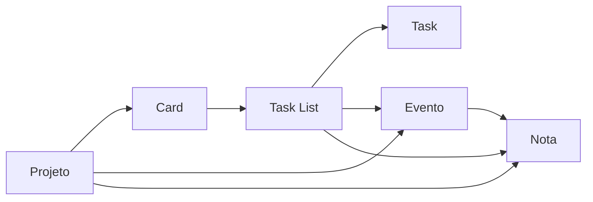

<div align="center">

# Planner-Py

App Desktop, offline-first, de organização e planejamento pessoal com foco em interconectividade e produtividade.

[Funcionalidades](#funcionalidades) | [Instalação](#instalação) | [Roadmap](#roadmap)

Ferramentas:


Detalhes:


Suporte:


</div>

## Nosso Objetivo

Criar um planejador pessoal **local, offline e altamente interconectado**, com três pilares centrais:

- **Interconectividade:** objetos do app (projetos, tasks, eventos, notas) se linkam bidirecionalmente entre si
- **Produtividade:** Eisenhower Matrix para priorização e Pomodoro para sessões de foco
- **Customização e Liberdade:** banco local, sem dependência de cloud, configurações extensivas e importação/exportação do DB

## Nosso Workflow



## Funcionalidades

### Interconectividade

<details>
<summary><strong>Projetos</strong></summary>

- Kanban com colunas e cards organizados por projeto
- Cards com prazo, ícone, cor e classificação Eisenhower
- Cada card pode ter uma Task List vinculada
- Drag & drop de cards entre colunas com persistência de ordem

> **W.I.P: Em desenvolvimento**

</details>

<details>
<summary><strong>Tasks</strong></summary>

- Task Lists com nome, cor, ícone, nota vinculada (informativo) e prazo — prazo é sempre um Evento de verdade por trás, com recorrência, nunca uma data literal
- Task individual é deliberadamente mínima: nome, ordem e concluída/não concluída — sem cor, ícone, nota ou evento próprios, herda tudo da lista
- Dentro de cada lista, tasks se dividem em "Vazias" e "Concluídas" (Settings decide se as concluídas aparecem), cada grupo com ordenação própria
- Drag & drop real (a ordem arrastada É a nova ordem salva, não só um `ORDER BY` de exibição) pra Task Lists e tasks; arrastar uma lista entre Fixadas/Outras fixa ou desfixa ela
- Seleção múltipla de Task Lists com cor/ícone/fixar/excluir em lote
- Lixeira só para Task Lists — task individual é sempre exclusão direta e permanente (recriar uma task é trivial, recriar uma lista inteira não); retenção configurável e purge automático, mesmo esquema da Lixeira de Notas
- Configurações dedicadas: contador do card (absoluto/percentual/nenhum), ordenação padrão ao abrir o app, exibir concluídas, visibilidade e retenção da lixeira

</details>

<details>
<summary><strong>Eventos</strong></summary>

- Calendário mensal e agenda por hora (grade 00h–23h) — form, agenda e o destaque do calendário sempre sincronizados na mesma data
- Recorrência em 4 tipos — intervalo fixo, dias da semana, dia do mês (multi-valor) ou anual — com trava de consistência: o dia/mês da data de início sempre faz parte da regra, pra nunca criar uma recorrência que não dispara na própria data em que foi criada
- Duração multi-dia: uma ocorrência pode se estender por N dias consecutivos, repetindo a mesma faixa de horário em cada um
- Auto-save por campo (cor, ícone, datas, recorrência) — sem botão "salvar"
- Busca por nome, mês ou dia, considerando as ocorrências reais de eventos recorrentes dentro do ano corrente
- Configurações dedicadas: formato de data/hora, primeiro dia da semana, destaque de dias da semana no calendário, painel inicial e posição da navegação no mobile

</details>

<details>
<summary><strong>Notas</strong></summary>

- Editor Markdown (EasyMDE) com toolbar customizada, preview em tempo real, blocos `mermaid` e syntax highlighting
- Auto-save; pastas com cor, ícone, fixação e ordenação
- Lixeira com retenção configurável (ou desligada), visível/oculta conforme Settings
- Busca global por título, pasta ou trecho do conteúdo
- Rastreio de última modificação, com ordenação por essa data
- Seleção múltipla, ações em lote e export individual/em lote (`.md`/`.txt`)
- Cor e ícone por nota e por pasta, seguindo a Cor Principal do sistema ou uma cor fixa da paleta

</details>

<details>
<summary><strong>Graph</strong></summary>

- Mapa visual (grafo) de como os objetos do app se relacionam entre si — parte do mesmo princípio de interconectividade que já liga Notas, Tasks, Projetos e Eventos, só que navegável
- Selecionar um objeto qualquer (ex: uma nota) e ver com quem ele se conecta — projeto, task list, prazos (eventos) etc. — como um "minimap" da teia de vínculos
- Ponto de entrada único pra enxergar relações que hoje só aparecem espalhadas, um vínculo de cada vez, dentro de cada módulo

> **W.I.P: Em desenvolvimento**

</details>

### Produtividade

<details>
<summary><strong>Pesquisa</strong></summary>

- Barra de pesquisa global acessível de qualquer tela
- Hoje cobre Notas (título, pasta, trecho do conteúdo), Eventos (nome, mês, dia — considerando ocorrências recorrentes dentro do ano corrente) e Tasks (nome de task, nome de Task List)
- Formato pensado pra crescer: cada módulo novo entra como uma seção a mais no mesmo resultado

> **W.I.P: Em desenvolvimento** — falta Projetos

</details>

<details>
<summary><strong>Priorização</strong></summary>

- Eisenhower Matrix: classifica tasks e cards nos 4 quadrantes (Fazer / Agendar / Delegar / Deletar)
- Ao classificar, o item muda de cor na lista ou kanban de origem
- Filtros por prazo, ordem alfabética e projeto

> **W.I.P: Em desenvolvimento**

</details>

<details>
<summary><strong>Foco</strong></summary>

- Timer Pomodoro com ciclos configuráveis: trabalho, descanso curto e descanso longo
- Alarme sonoro (Web Audio API) e popup que puxa a janela ao fim de cada fase
- Contador de ciclos completados e indicador de fase atual

> **W.I.P: Em desenvolvimento**

</details>

### Customização

<details>
<summary><strong>Visuais</strong></summary>

- Tema claro/escuro/sistema, com Cor de Destaque (accent) aplicada via CSS variables — nunca sobrescreve as cores literais da paleta (uma nota "azul" continua azul, independente do accent escolhido)
- Fonte do app (padrão do sistema, serifada ou monoespaçada), aplicada em tempo real sem recarregar a página
- Ícone e cor individual por objeto (Bootstrap Icons — mais de 2.000 ícones)

</details>

<details>
<summary><strong>Comportamentos</strong></summary>

- Configurações de janela (resolução, orientação, redimensionável) — aplicadas no próximo boot do app
- Preferências dedicadas por módulo, hoje em Notas (pasta padrão aberta, fonte/tamanho do preview, modo de abertura, ordenação, lixeira) e Eventos (formato de data/hora, primeiro dia da semana, destaque de dias, painel inicial no mobile) — cresce junto com cada módulo novo
- Auto-save de toda alteração, sem botão "salvar configurações"
- Reset para os valores padrão a qualquer momento

</details>

<details>
<summary><strong>Portabilidade</strong></summary>

- Export e import do banco de dados (`planner.db`) entre máquinas
- Export e import de settings para JSON
- Diálogo de arquivo nativo via PyWebView — sem dependência de cloud

> **W.I.P: Em desenvolvimento**

</details>

<details>
<summary><strong>Perfis (Vaults)</strong></summary>

- Sem sentido ter "contas" num app 100% offline e sem sync — a ideia foi reformulada como **vaults**, no espírito do Obsidian: cada perfil é um arquivo `.db` totalmente separado e independente (ex: Trabalho, Faculdade, Pessoal), não uma tabela compartilhada com uma coluna de dono
- Trocar de perfil = apontar o app pra outro arquivo `.db` — sem schema cruzado entre vaults, sem passo extra em cada criação de objeto perguntando "de qual perfil é isso?"
- Exportar um perfil individual = copiar o arquivo `.db` correspondente
- Planejado: proteção por senha opcional por vault (útil pra separar, por exemplo, um perfil de trabalho); visão agregada entre vaults via `ATTACH DATABASE` do SQLite, sem abrir mão do isolamento de cada arquivo
- Mover um objeto entre vaults fica de fora do escopo inicial — dado o quanto o schema hoje é interligado (task ↔ evento, tasklist ↔ evento, card ↔ tasklist, nota ↔ pasta), não existe uma operação atômica "bonita" pra isso; a solução inicial é export+import manual

> **W.I.P: Em desenvolvimento**

</details>

## Roadmap

- [x] Foundation: docs, schema, modelos ORM e estrutura base
- [x] Notes — CRUD completo + editor Markdown + Mermaid
- [x] Tasks + Task Lists — CRUD + drag & drop + Lixeira + busca
- [x] Events — calendário + recorrência em 4 tipos + duração multi-dia
- [ ] Projects / Kanban — colunas, cards, drag & drop
- [ ] Interconectividade — vínculos bidirecionais entre todos os objetos (Notas ↔ Tasks/Task Lists e Task Lists ↔ Eventos já funcionam; falta Projects existir de verdade pra fechar o ciclo)
- [ ] Eisenhower Matrix — classificação + reflexo visual nas listas
- [ ] Pomodoro — timer real + ciclos + alarme sonoro
- [x] Settings + Customização — tema, cores, fontes, preferências por módulo
- [ ] Import/Export do banco de dados
- [ ] Graph — mapa de relações entre todos os objetos interligados
- [ ] Perfis (Vaults) — múltiplos `.db` isolados, troca/export por perfil
- [ ] Dashboard e polish final

## Stack

<div align="center">

| Camada | Ferramentas |
|-|-|
| Back-End | Python · Flask 3.1.3 · SQLAlchemy 2.0.51 |
| Banco de Dados | SQLite local (`planner.db`) |
| Desktop | PyWebView 6.2.1 · janela configurável (resolução/orientação/redimensionável via Settings) |
| Front-End | Bootstrap 5.3.8 · Bootstrap Icons 1.13.1 · Jinja2 |
| Extras | FullCalendar 6 · EasyMDE · Mermaid.js · marked.js · highlight.js (todos offline) |

</div>

## Instalação

```bash
# Clone o repositório
git clone https://github.com/NycolasGarcia/Planner-Py.git

# Entre na pasta
cd Planner-Py

# Crie o ambiente virtual
python -m venv venv

# Ative o ambiente
venv\Scripts\activate

# Instale as dependências
pip install -r requirements.txt

# Execute
py app.py
```

Alternativa sem terminal: rode `dist/boot.py` (duplo clique/atalho) — cria o `venv`, instala as dependências e abre o app sozinho, caso ainda não existam.

## Estrutura do Projeto

```
Planner-Py/
│
├── app.py                       # Entrada: Flask + PyWebView
├── requirements.txt
│
├── dist/
│   └── boot.py                  # Launcher (cria venv, instala deps, abre sem terminal)
│
├── db/
│   ├── base.py                  # DeclarativeBase
│   ├── database.py              # Engine + SessionLocal (Android-aware)
│   └── init_db.py               # Criação das tabelas + migrações
│
├── models/                      # ORM models (um arquivo por entidade)
│   ├── note.py · note_folder.py
│   ├── event.py
│   ├── project.py · project_column.py · project_card.py
│   ├── task_list.py · task.py
│   └── settings.py
│
├── routes/                      # Flask blueprints (um arquivo por módulo)
│
├── templates/
│   ├── common/                  # base.html, header, aside
│   │   └── modals/              # search_bar, icon_picker, color_picker, folder_picker, changelog
│   └── *.html                   # Uma página por módulo
│
└── static/
    ├── bootstrap/                # Bootstrap 5.3.8 (offline)
    ├── bootstrap-icons-1.13.1/   # Bootstrap Icons (offline)
    ├── easymde/                  # Editor Markdown de Notas (offline)
    ├── fullcalendar/              # Calendário de Eventos (offline)
    ├── highlight/                 # Syntax highlighting (offline)
    ├── mermaid/                   # Diagramas em blocos de código (offline)
    ├── aos/
    └── js/

```

## Contato

<div align="center">

| Plataforma | Link |
|------------|------|
|  LinkedIn | <a href="https://www.linkedin.com/in/NycolasAGRGarcia/" target="_blank">Acessar</a> |
|  GitHub | <a href="https://github.com/NycolasGarcia" target="_blank">Acessar</a> |
|  Gmail | <a href="mailto:nycolasagrg.work@gmail.com">Enviar</a> |
|  Vercel | <a href="https://dev-nycolas-garcia.vercel.app/" target="_blank">Visitar</a> |

</div>
